# Cazpian Web Project Architecture Flow

## Project Overview
This flowchart illustrates the architecture, data flow, and user journey of the Cazpian web application - an AI-powered data analytics platform built with React, TypeScript, and modern web technologies.

## Architecture Flow

```mermaid
flowchart TD
    %% User Entry Points
    A[User Visits Website] --> B{Authentication Check}
    B -->|Public User| C[Public Routes]
    B -->|Admin User| D[Admin Routes]
    
    %% Application Bootstrap
    E[main.tsx] --> F[App.tsx]
    F --> G[ErrorBoundary]
    G --> H[ThemeProvider]
    H --> I[AdminProvider]
    I --> J[Router]
    
    %% Core Providers & Context
    J --> K[BrowserRouter]
    K --> L[ThemeContext]
    K --> M[AdminContext]
    
    %% Theme Management
    L --> N[Light/Dark/System Mode]
    N --> O[localStorage Persistence]
    N --> P[CSS Class Updates]
    
    %% Admin Context
    M --> Q[Site Configuration]
    M --> R[Menu Management]
    M --> S[Content Management]
    M --> T[Resource Management]
    
    %% Public Routes Structure
    C --> U[Header Component]
    U --> V[Navigation Dropdown]
    V --> W[Responsive Menu]
    
    C --> X[Main Content]
    X --> Y[HomePage]
    X --> Z[Product Pages]
    X --> AA[Solutions Pages]
    X --> BB[Resources]
    X --> CC[About/Contact]
    
    %% HomePage Sections
    Y --> DD[Hero Section]
    Y --> EE[Trusted Logos]
    Y --> FF[Multi-Engine Ready]
    Y --> GG[Compute Targets]
    Y --> HH[Feature Cards]
    Y --> II[Product Showcase]
    Y --> JJ[CTA Section]
    
    %% Multi-Engine Section
    FF --> KK[Apache Spark]
    FF --> LL[Trino]
    FF --> MM[Apache Flink]
    
    %% Compute Targets Section
    GG --> NN[Kubernetes]
    GG --> OO[AWS Managed]
    GG --> PP[Cross-Cloud & On-Prem]
    GG --> QQ[Tagging & Discovery]
    
    %% Admin Routes
    D --> RR[Admin Login]
    RR --> SS[Protected Route]
    SS --> TT[Admin Dashboard]
    TT --> UU[Site Config Editor]
    TT --> VV[Content Editor]
    TT --> WW[Menu Editor]
    TT --> XX[Resources Editor]
    
    %% Shared Components
    U --> YY[Footer]
    U --> ZZ[Support Chat]
    U --> AAA[Cookie Consent]
    U --> BBB[SEO Component]
    U --> CCC[Analytics]
    
    %% User Interactions
    YY --> DDD[Social Links]
    YY --> EEE[Contact Info]
    ZZ --> FFF[Live Chat Widget]
    CCC --> GGG[Event Tracking]
    
    %% Styling & Animation
    HHH[Tailwind CSS] --> III[Responsive Design]
    HHH --> JJJ[Dark Mode Support]
    KKK[Framer Motion] --> LLL[Scroll Animations]
    KKK --> MMM[Hover Effects]
    KKK --> NNN[Page Transitions]
    
    %% Performance & SEO
    OOO[Code Splitting] --> PPP[Lazy Loading]
    PPP --> QQQ[Page Components]
    RRR[React Helmet] --> SSS[Meta Tags]
    SSS --> TTT[Structured Data]
    
    %% Error Handling
    G --> UUU[Error Boundaries]
    UUU --> VVV[Fallback UI]
    UUU --> WWW[Sentry Integration]
    
    %% Build & Deployment
    XXX[Vite Build] --> YYY[Production Bundle]
    YYY --> ZZZ[Static Assets]
    ZZZ --> AAAA[CDN Deployment]
    
    %% Testing
    BBBB[Vitest] --> CCCC[Unit Tests]
    BBBB --> DDDD[Component Tests]
    BBBB --> EEEE[Accessibility Tests]
    
    %% Key Features
    FFFF[Multi-Engine Support] --> GGGG[Spark/Trino/Flink]
    HHHH[Compute Targets] --> IIII[K8s/AWS/Cross-Cloud]
    JJJJ[AI-Driven Analytics] --> KKKK[Semantic Layer]
    LLLL[Enterprise Security] --> MMMM[RBAC/ABAC]
    
    %% Data Flow
    NNNN[User Input] --> OOOO[Form Validation]
    OOOO --> PPPP[API Calls]
    PPPP --> QQQQ[State Updates]
    QQQQ --> RRRR[UI Re-render]
    
    %% External Integrations
    SSSS[Analytics] --> TTTT[User Behavior]
    UUUU[Support Chat] --> VVVV[Customer Service]
    WWWW[Sentry] --> XXXX[Error Monitoring]
    YYYY[SEO] --> ZZZZ[Search Optimization]
    
    %% Styling
    classDef userFlow fill:#e1f5fe,stroke:#01579b,stroke-width:2px
    classDef component fill:#f3e5f5,stroke:#4a148c,stroke-width:2px
    classDef context fill:#e8f5e8,stroke:#1b5e20,stroke-width:2px
    classDef feature fill:#fff3e0,stroke:#e65100,stroke-width:2px
    classDef integration fill:#fce4ec,stroke:#880e4f,stroke-width:2px
    
    class A,B,C,D userFlow
    class E,F,G,H,I,J,K component
    class L,M,N,O,P,Q,R,S,T context
    class FF,GG,HH,II,JJ,KK,LL,MM,NN,OO,PP,QQ feature
    class SSS,TTT,UUU,VVV,WWW,XXXX,YYYY,ZZZZ integration
```

## Key Architecture Components

### 1. **Application Bootstrap**
- `main.tsx`: Entry point with Sentry integration
- `App.tsx`: Main application component with routing
- Error boundaries for graceful error handling

### 2. **Context Providers**
- **ThemeProvider**: Manages light/dark/system theme modes
- **AdminProvider**: Handles site configuration and content management

### 3. **Routing Structure**
- **Public Routes**: Homepage, products, solutions, resources
- **Admin Routes**: Protected admin dashboard and content management
- **Code Splitting**: Lazy loading for performance optimization

### 4. **Core Features**
- **Multi-Engine Ready**: Apache Spark, Trino, Apache Flink support
- **Compute Targets**: Kubernetes, AWS, cross-cloud deployment options
- **AI-Driven Analytics**: Semantic layer and intelligent insights
- **Enterprise Security**: RBAC/ABAC and governance

### 5. **User Experience**
- **Responsive Design**: Mobile-first approach with Tailwind CSS
- **Animations**: Framer Motion for smooth interactions
- **Accessibility**: Skip links, ARIA labels, keyboard navigation
- **Performance**: Code splitting, lazy loading, optimized assets

### 6. **Content Management**
- **Dynamic Content**: Admin-configurable site content
- **Menu Management**: Dynamic navigation structure
- **Resource Management**: Documents, whitepapers, case studies
- **SEO Optimization**: Meta tags, structured data, sitemaps

### 7. **Integrations**
- **Analytics**: User behavior tracking
- **Support Chat**: Live customer service
- **Error Monitoring**: Sentry integration
- **Cookie Management**: GDPR compliance

## Technology Stack

- **Frontend**: React 18, TypeScript, Vite
- **Styling**: Tailwind CSS, Framer Motion
- **Routing**: React Router v7
- **State Management**: React Context API
- **Forms**: React Hook Form with Yup validation
- **Testing**: Vitest, Testing Library
- **Build**: Vite with PWA support
- **Monitoring**: Sentry for error tracking
- **SEO**: React Helmet Async

## User Journey Flow

1. **Entry**: User visits website
2. **Navigation**: Browse through product information
3. **Engagement**: Interact with features and CTAs
4. **Conversion**: Book meeting or try agent studio
5. **Support**: Access help through chat or resources

This architecture provides a scalable, maintainable, and user-friendly platform for showcasing Cazpian's AI-powered data analytics capabilities.
